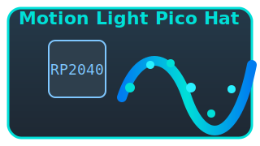

# Motion Light Pico Hat



An interactive dual-core LED "water flow" and tilt simulation for the Raspberry Pi Pico / Pico 2 using a WS2812B LED strip and an MPU-6050 IMU (or a built‑in software tilt simulator when the sensor is absent). The project demonstrates:

- Dual-core coordination on RP2040 (Core 0: sensor / simulation; Core 1: LED rendering + serial output)
- Smooth physics-like motion (velocity, damping, bounce) converted to a glowing LED blob that shifts and reflects within the strip
- ASCII real-time visualization in the Serial Monitor for debugging without LEDs
- Seamless fallback to simulated tilt if the accelerometer is not detected

## Supported Boards

| Board                      | PlatformIO Environment | Arduino IDE Board                        | Notes                                      |
|----------------------------|------------------------|------------------------------------------|--------------------------------------------|
| Raspberry Pi Pico (RP2040) | `pico_official`        | "Raspberry Pi Pico" (Earle Philhower core) | Fully supported                            |
| Raspberry Pi Pico 2 (RP2350) | `rpipico2_project`      | "Raspberry Pi Pico 2" (Earle Philhower core) | Use with updated RP2350 core; see below    |

*Pico 2 support uses the RP2350 chip. Logic and pin usage are identical. To enable, adjust `platformio.ini` and ensure the correct board/platform is selected.*

> **Development Note:**
> This project was requested for the original Raspberry Pi Pico (RP2040). However, all development and testing were performed on a Raspberry Pi Pico 2 (RP2350) board. The code is fully compatible with the normal Pico board and was written to ensure it works on both models. If you use a Pico 2, select the correct environment in `platformio.ini` or Arduino IDE as described above.

## Features

- Real-time LED physics (position, velocity, damping, reflection)
- Adaptive glow with Gaussian/exponential falloff and shimmer
- Dual-core separation: deterministic LED refresh at ~30 FPS independent of sensor loop (~50 Hz)
- Automatic hardware detection for MPU‑6050 at I2C address `0x68`; simulation fallback if absent
- Lightweight inter-core communication (volatile globals)

## Directory Structure


```
.
├── platformio.ini      # PlatformIO build configuration
├── src/
│   └── main.cpp        # Main application source (dual-core logic, PlatformIO)
├── MotionLightPicoHat_Arduino/
│   └── MotionLightPicoHat_Arduino.ino # Arduino IDE-friendly sketch (identical logic)
├── lib/                # (Optional) user libraries
├── include/            # (Optional) project headers
├── PCB/                # Hardware design files and outputs
│   ├── pico.kicad_sch      # KiCad schematic
│   ├── pico.kicad_pcb      # KiCad PCB layout
│   ├── pico.kicad_pro      # KiCad project settings
│   ├── pico.kicad_prl      # KiCad project local settings (ignore in git)
│   ├── PCB_Print/          # Gerber and drill files for manufacturing
│   │   └── pico-PCB(gbr).zip # Gerber/drill manufacturing archive for PCB fabrication
│   └── Assets/             # PCB-related images and logos
├── assets/             # Icons and images for documentation
├── README.md           # This documentation
├── LICENSE             # Project license
```

- `MotionLightPicoHat_Arduino/` contains an Arduino IDE-friendly `.ino` file for easy use. Open this folder and file directly in Arduino IDE for the same functionality as `src/main.cpp`.

- `PCB/` contains all hardware design files: schematic, PCB layout, project settings, gerbers (in `PCB_Print/`), backups, and images.

## Hardware Requirements

| Component | Purpose | Notes |
|-----------|---------|-------|
| Raspberry Pi Pico or Pico 2 | MCU | USB power + programming |
| WS2812B LED strip (30 LEDs) | Visual effect | Data pin connected to GPIO 22 |
| MPU-6050 IMU (optional) | Tilt sensing | I2C at `0x68` on GPIO 4 (SDA) and GPIO 5 (SCL) |
| Power supply (5V recommended) | LED power | Ensure common ground with Pico |

### Pin Mapping

| Signal | RP2040 GPIO | Description |
|--------|-------------|-------------|
| LED Data | 22 | WS2812B DIN |
| I2C SDA | 4 | MPU-6050 SDA |
| I2C SCL | 5 | MPU-6050 SCL |

## Software Dependencies

- [FastLED](https://github.com/FastLED/FastLED) (≥3.10.x) for LED control
- Wire (built-in with Arduino core) for I2C communication


Optional: Adafruit MPU6050 library is **not required** because raw register reads are used for robustness and minimal overhead.

## Serial Output Compatibility (PlatformIO vs Arduino IDE)

The code supports both single-line (overwriting) and multi-line serial output for compatibility with different serial monitors:

- **Single-line output** (default, works in PlatformIO and most advanced terminals):
   - Set `#define USE_CARRIAGE_RETURN 1` at the top of `src/main.cpp`.
   - Output will always overwrite the same line, giving a live-updating effect.
- **Multi-line output** (for Arduino IDE Serial Monitor):
   - Set `#define USE_CARRIAGE_RETURN 0` at the top of `src/main.cpp`.
   - Each update prints on a new line (Arduino IDE Serial Monitor does not support carriage return overwrite).

**How to switch:**

```cpp
#define USE_CARRIAGE_RETURN 1 // or 0 for Arduino IDE
```

This macro is at the top of `src/main.cpp`. Change it as needed for your environment.

## Dual-Core Flow Overview

| Core | Function | Key Loop Rate |
|------|----------|---------------|
| Core 0 (`setup()` / `loop()`) | I2C sensor read or simulation | ~50 Hz (20 ms delay) |
| Core 1 (`setup1()` / `loop1()`) | LED physics + rendering + ASCII output | ~30 FPS (33 ms delay) |

Synchronization uses simple `volatile` variables (`g_tilt_x`, `g_sensor_connected`). For production-grade systems with higher complexity, use mutexes or queues.

## Building with PlatformIO

### 1. Prerequisites

- PlatformIO Core or VS Code + PlatformIO extension installed

### 2. Key `platformio.ini` Excerpt

```ini
[env:pico_official]
platform = https://github.com/maxgerhardt/platform-raspberrypi.git
board = pico
framework = arduino
board_build.core = earlephilhower
monitor_speed = 115200
lib_deps = Wire, FastLED

[env:rpipico2_project]
platform = https://github.com/maxgerhardt/platform-raspberrypi.git
board = rpipico2
framework = arduino
board_build.core = earlephilhower
monitor_speed = 115200
lib_deps =Wire, FastLED
```

### 3. Build & Upload

```bash
# Build
platformio run -e pico_official

# (Optional) Clean
platformio run -e pico_official -t clean

# Upload (UF2 drag-and-drop or configured uploader)
platformio run -e pico_official -t upload
```

If using UF2: hold BOOTSEL while plugging the Pico, then copy the generated `firmware.uf2` from `.pio/build/pico_official/` to the mounted drive.

### 4. Monitor Serial Output

```bash
platformio device monitor -e pico_official --baud 115200
```

You will see a single updating line like:

```text
[H/W] Tilt (X): -0.12 | Pos: 15.44 | Flow: [   __====~~~~====__   ]
```

`[SIM]` indicates the fallback simulation mode when the sensor is absent.

## Using Arduino IDE Instead

1. Open Arduino IDE (2.x recommended).
2. Preferences → Additional Boards Manager URLs:
   - `https://github.com/earlephilhower/arduino-pico/releases/download/global/package_rp2040_index.json`
3. Boards Manager: install "RP2040" (Earle Philhower).
4. Board: Tools → Board → Raspberry Pi RP2040 Boards → Raspberry Pi Pico (or Pico 2).
5. Open `MotionLightPicoHat_Arduino/MotionLightPicoHat_Arduino.ino` directly in Arduino IDE (recommended), or copy code from `src/main.cpp` if you want to create your own sketch. Both files are kept in sync and provide the same functionality (including dual-core support with `setup1()` / `loop1()`).
6. Library Manager: install FastLED.
7. Upload:
   - Default: Hold BOOTSEL, plug in, then Upload.
   - Optional: Select Picotool method if installed.
8. Open Serial Monitor @ 115200 baud.

## LED Animation Logic

1. Read tilt acceleration (real or simulated) → scaled to influence velocity.
2. Apply damping & clamp velocity.
3. Integrate velocity → position of the "water mass".
4. Bounce at ends with energy loss (`BOUNCE_DAMPING`).
5. Glow profile: `intensity = exp(-distance * GLOW_DECAY)` plus shimmer sine term.
6. Map intensity to color scaling on `CRGB WATER_COLOR`.

## Extending the Project

| Idea | Description |
|------|-------------|
| Add Y/Z tilt | Expand to 2D matrix or color modulation |
| Sensor fusion | Incorporate complementary filter for stable angles |
| Persistent config | Store brightness or mode in flash/EEPROM |
| Multi-effect engine | Switch between "water", "fire", "sparkle" modes via serial commands |

## Troubleshooting

| Symptom | Possible Cause | Fix |
|---------|----------------|-----|
| `Arduino.h` missing (PlatformIO) | Wrong platform core | Use Earle Philhower core via custom platform URL as shown |
| All LEDs off | Power issue or brightness too low | Confirm 5V supply & `FastLED.setBrightness()` value |
| `[SIM]` always shown | Sensor not detected | Check wiring, address `0x68`, pull-ups on SDA/SCL |
| Flickering LEDs | Long wires or insufficient grounding | Add data line resistor (~330Ω), ensure shared ground |
| Serial gibberish | Baud mismatch | Use 115200 in monitor |

## Performance Notes

- RAM usage is minimal (<5%), leaving headroom for additional features.
- Using software glow math with simple `exp()` calls; performance acceptable for 30 LEDs at 30 FPS.
- FastLED auto-selects software SPI timing for WS2812B (normal).

## Safety & Power Considerations

- At full white, WS2812B LED strips can draw ~60mA/LED. This animation uses modest brightness (blue tint) but plan power budget (e.g., 30 LEDs ≈ 1.8A worst case).
- Always share ground between Pico and LED power.

## License

Add your chosen license (e.g., MIT, Apache-2.0) here. Example MIT header:

```text
Copyright (c) 2025 <Your Name>
Permission is hereby granted, free of charge, to any person obtaining a copy...
```

## Acknowledgements

- Earle Philhower RP2040 Arduino core
- FastLED community
- Documentation generated with AI assistance (GitHub Copilot)

---
